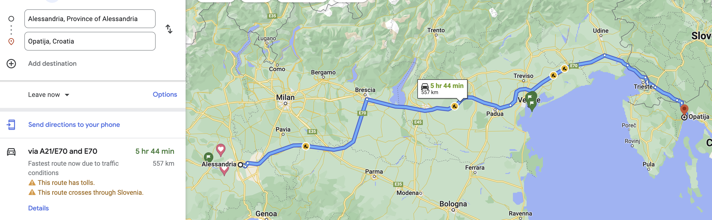
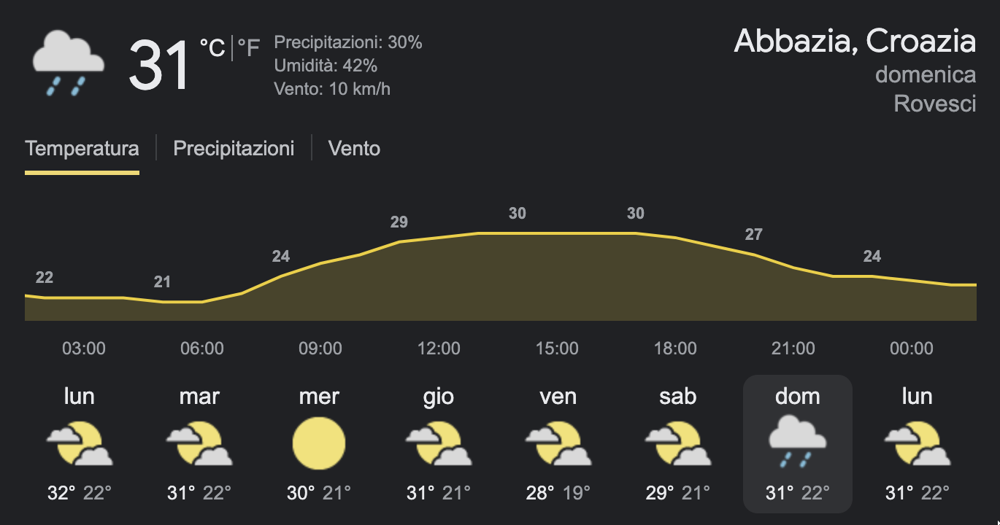

## Giorno 1 [14/08] 

**Alessandria - [Abbazia](https://www.google.it/maps/dir//Opatija,+Croatia/@45.3395299,14.295173,14z/data=!4m9!4m8!1m0!1m5!1m1!1s0x4764a84acbb5741b:0x400ad50862bc290!2m2!1d14.305196!2d45.3376197!3e0)**

- **Durata:** 6:40 h (anche di più) **Ho aggiunto un ora alla stima**
- **Partenza:** 4:00
- **Arrivo:**10:40

### Meteo

### Pernottamento

- **AirBnb** [[Poszione]](https://www.google.it/maps/dir//51415,+Tuli%C5%A1evica,+Croatia/@45.2323581,14.1791204,9.89z/data=!4m9!4m8!1m0!1m5!1m1!1s0x4763579c1f51db1d:0xa2ace1a0bc36dccd!2m2!1d14.2609492!2d45.281838!3e0)
- **Codice Prenotazione:**HM889RZXKW
- **Check-in:** Dopo le ore 12:00
-  [Tuliševica  prenotazione confermata.pdf](index.assets/Tuliševica  prenotazione confermata.pdf) 

