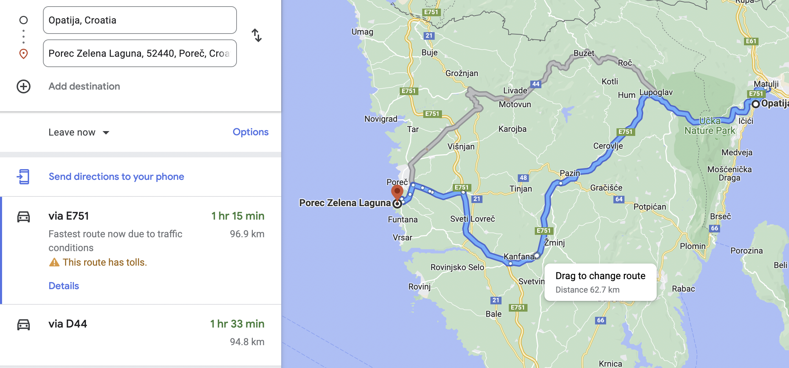
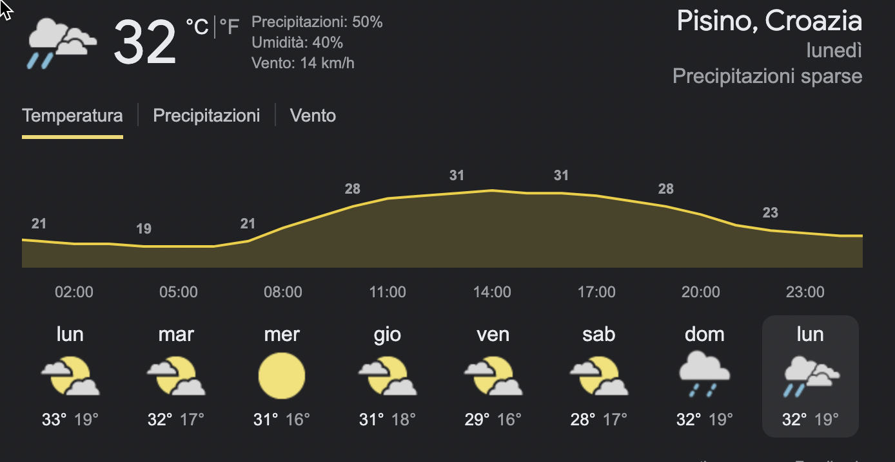

## Giorno 2-3 [15/08 - 16/08]

**Abbazia - [Porec](https://www.google.it/maps/dir//Pore%C4%8D,+Croatia/@45.2271598,13.5596348,13z/data=!4m9!4m8!1m0!1m5!1m1!1s0x477c979c94879029:0x7a9e5b587feaabd!2m2!1d13.5947399!2d45.2271652!3e0) (Zona della costa)**

- **Durata:** 1:30 h
- **Partenza:** 10:00
- **Arrivo:** 11:30 h

**In alternativa all'andare a porec e visitare fiume e pernottare il 15 nel entroterra verso la costa**

È presumibile che porec sia molto turistica e trafficata, potrebbe essere interessante scendere per la costa 

### Meteo 

- **15/08** Potrebbe invalidare il free camping 

### Pernottamento

- **[Airbnb](https://www.airbnb.it/s/Porec--Cro%C3%A1cia/homes?tab_id=home_tab&refinement_paths%5B%5D=%2Fhomes&flexible_trip_lengths%5B%5D=one_week&place_id=ChIJKZCHlJyXfEcRvar-h7XlqQc&date_picker_type=calendar&checkin=2022-08-15&checkout=2022-08-16&adults=4&source=structured_search_input_header&search_type=filter_change&ne_lat=45.35676284524595&ne_lng=14.044834770853726&sw_lat=44.82060249492229&sw_lng=13.53534380405685&zoom=11&search_by_map=true&price_max=135)** 

- **[Booking](https://www.booking.com/searchresults.it.html?label=gog235jc-1DCAEoggI46AdIFFgDaHGIAQGYARS4AQfIAQzYAQPoAQH4AQKIAgGoAgO4AsD0zpcGwAIB0gIkODQ2YzA2Y2EtM2Q1OC00ZDg4LWJhMzktMzdkNGI0NmU4ODg22AIE4AIB&sid=14c3b712ae6963fe7e421ad766a16f62&aid=397594&ss=Pore%C4%8D+%28Parenzo%29&ssne=Pore%C4%8D+%28Parenzo%29&ssne_untouched=Pore%C4%8D+%28Parenzo%29&lang=it&src=searchresults&dest_id=-92761&dest_type=city&checkin=2022-08-16&checkout=2022-08-17&group_adults=4&no_rooms=1&group_children=0&sb_travel_purpose=leisure&nflt=pri%3D1%3Bpri%3D2%3B%3Boos%3D1)**

- **[Campeggio](https://www.google.com/search?q=campeggio+porec+15+agosto+croazia&sxsrf=ALiCzsauMi9ZViyX_sCxT49VyB6KTh-vcA%3A1660142507504&ei=q8PzYoutHpapxc8Pi4-p2Ak&ved=0ahUKEwjLrr7jwLz5AhWWVPEDHYtHCpsQ4dUDCA4&uact=5&oq=campeggio+porec+15+agosto+croazia&gs_lcp=Cgdnd3Mtd2l6EAM6BwgAEEcQsANKBAhBGABKBAhGGABQ5LYDWKLmA2DA6ANoBXABeACAAcQBiAHKBZIBAzguMZgBAKABAcgBCMABAQ&sclient=gws-wiz)**